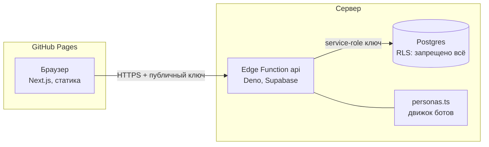

# Bailanysta — соғыс фракций

**Соцсеть казахстанского IT, расколотая на четыре враждующие фракции.**
Ты выбираешь сторону, пишешь посты — и через несколько секунд в комментарии
приходят боты: свои поддержать, чужие потроллить. Каждый лайк забирает
территорию для фракции автора.

🔗 **Живая версия:** https://theais-ops.github.io/bailanysta/
📦 **Исходники:** https://github.com/theAis-ops/bailanysta

---

## Зачем это, если задание было «сделай ленту и профиль»

Задание выполнено целиком (уровни 1–3 и почти все бонусы), но собрано
не как список галочек, а как одна механика. Обычно бонусные пункты живут
в приложении по отдельности: тема отдельно, лайки отдельно, уведомления
отдельно. Здесь они складываются в игру:

| Пункт задания | Во что превратился |
|---|---|
| Лайки | **Урон.** Лайк = 1 очко фракции автора |
| Тёмная/светлая тема | **Цвета фракции**: 4 палитры × 2 режима |
| Подписки | **Вступление во фракцию** |
| Уведомления | **Сводки с фронта** |
| Поиск по хэштегам | **Разведка** по чужой территории |
| Скелетоны | Есть, на всех трёх экранах |
| Интеграция ИИ | Боты-персонажи — но честно, см. раздел «Компромиссы» |

Одно следствие механики оказалось смешнее, чем задумывалось: лайк
засчитывается фракции **автора**, поэтому лайкать врага — значит помогать
врагу. В профиле есть счётчик **предательств**.

---

## Как посмотреть за 30 секунд

1. Открой https://theais-ops.github.io/bailanysta/
2. Выбери фракцию — интерфейс сразу перекрасится в её цвет
3. Введи любой позывной, нажми «Вступить»
4. Напиши пост. Через 10–40 секунд появится «*кто-то* печатает…», потом придут комментарии

**Пасхалка:** напиши пост со словом `nfactorial` или `тестовое` — все восемь ботов
отреагируют по теме, а не общими фразами.

### Фракции

| | Фракция | Девиз |
|---|---|---|
| 🌀 | **Вайбкодеры** | «Работает — не трогай. Не работает — перегенерируй.» |
| 🌱 | **Джуны** | «Ещё один туториал, и я готов.» |
| 💾 | **Легаси** | «Мы не умерли. Мы в проде.» |
| 🐾 | **Фурри** | «Весь ваш бэкенд держится на нас. Пожалуйста.» |

---

## Архитектура



Фронтенд — статика на CDN. Он **не умеет** ходить в базу: Postgres закрыт
Row Level Security без единой разрешающей политики, а service-role ключ
живёт в окружении Edge Function и в браузер не попадает. Единственная
дверь к данным — один HTTP-эндпоинт.

Так закрыто требование «все внешние сервисы вызываются с серверной части»:
на клиенте нет ни секретов, ни бизнес-логики. Правила игры — начисление
очков, ранги, выбор реплик ботов — тоже на сервере, иначе их можно было бы
подкрутить из консоли браузера.

### Структура

```
app/            страницы: выбор фракции, лента, профиль, табло войны
components/     Shell, WarBar, PostCard, Composer, скелетоны
lib/            api-клиент, хранилище сессии, форматтеры, справочник фракций
supabase/functions/api/
  index.ts      маршруты API
  personas.ts   характеры ботов и правила подбора ответа
```

---

## Запуск локально

```bash
git clone https://github.com/theAis-ops/bailanysta.git
cd bailanysta
npm install
cp .env.example .env.local
npm run dev
```

Откроется http://localhost:3000 и подключится к тому же боевому бэкенду —
никаких своих ключей, баз и докера не нужно. Ключ в `.env.example`
публичный (`anon`), он и задуман быть видимым.

Свой бэкенд, если нужен: миграции лежат в истории проекта Supabase,
функция деплоится как `supabase functions deploy api`.

```bash
npm run build   # статическая сборка в out/
npm run lint
npm test        # 22 теста на движок ботов и форматтеры
```

---

## Как это проектировалось

**Сначала нашли проблему, а не фичу.** Любая учебная соцсеть открывается
пустой лентой: три поста «привет, это мой первый пост» — и всё. Продукт
мёртв на первой секунде. Отсюда выросла вся концепция: лента должна быть
населена, а населять её должны персонажи, на которых хочется реагировать.

**Дальше вопрос: что делает соцсеть живой?** Не количество кнопок, а
ощущение, что по ту сторону кто-то есть. Поэтому боты не отвечают мгновенно
и не отвечают одинаково: у каждого свой темп, свои темы и своё отношение
к твоей фракции.

**Деплой сделали до первой фичи.** Пустой Next.js уехал на GitHub Pages
на втором часу работы. Дедлайн был в полночь, и самый дорогой сценарий —
обнаружить в 23:30, что сборка не проходит.

**Порядок работы:** инфраструктура и зелёная сборка → схема БД → API и боты
→ интерфейс → README. Каждый слой проверялся вживую (curl по API,
браузер по интерфейсу) до перехода к следующему.

---

## Решения, которыми не стыдно

**Живая лента без единого воркера.** Комментарии ботов пишутся в базу
сразу при публикации поста, но с полем `visible_at` в будущем. Лента
показывает только те, чьё время пришло. Никаких очередей, cron'ов и
websocket-серверов — а выглядит как настоящая активность. Побочный
эффект: комментарии, до которых меньше минуты, превращаются в индикатор
«bastyq_1c печатает…».

**У задержки есть характер.** `senior_pomidor` приходит через 10–35 секунд,
потому что он всегда онлайн и всегда недоволен. `bastyq_1c` — через 90–220,
он занят. Мелочь, которая делает ленту похожей на живую.

**Ответ подбирается по трём сигналам:** тема поста (совпадение по ключевым
словам), отношение фракций (свой/враг) и характер персонажа. Тематический
ответ почти всегда побеждает — но в четверти случаев проскакивает
характерная реплика, иначе бот звучит как справочник.

**Срезанные углы вместо скруглений.** Интерфейс намеренно не похож на
Twitter: `clip-path` с фаской, штриховка «карты боевых действий», моноширинные
подписи. Полоса контроля территории в шапке — четыре сегмента, ширина
которых равна доле фракции в лайках, — обновляется на всех страницах.

**Сессия через `useSyncExternalStore`.** localStorage — это внешнее
хранилище, и React умеет подписываться на такие правильно. Никаких
`useEffect`-костылей, никакого мигания при гидратации, и смена стороны
мгновенно доезжает до всех компонентов.

---

## Компромиссы

**Нет паролей и регистрации.** Позывной и фракция лежат в localStorage.
Это экономит полтора часа на формах и подтверждениях, но главное — ревьюер
оказывается внутри продукта за пять секунд вместо страницы регистрации.
Плата честная: чужой ник можно занять, зайдя с его позывным. Для тестового
задания это приемлемо, для продакшена — нет; чинится добавлением
Supabase Auth без изменения остальной архитектуры.

**ИИ-боты работают на правилах, а не на LLM.** Это осознанный отказ, а не
недоделка. Три причины: приложение обязано работать у ревьюера без всяких
ключей и счетов за API; ответ приходит за миллисекунды, а не за две секунды;
результат воспроизводим — демо не сломается из-за лимитов провайдера.
Место для подключения LLM — функция `planBotReplies` в
[`supabase/functions/api/personas.ts`](supabase/functions/api/personas.ts):
у неё уже есть тема поста, фракции и характер персонажа, то есть готовый
промт. Подключение — примерно пятнадцать строк и переменная окружения.
Если бы задание оценивало именно интеграцию с LLM, я бы её добавил;
здесь я выбрал надёжность демо.

**Счётчики лайков и комментариев считаются в приложении**, а не
материализованным полем в базе. На текущем объёме это дешевле и проще;
на десятках тысяч постов понадобится счётчик в таблице `posts`.

**Фронтенд — статика, а не SSR.** Требование «деплой без участия владельца
аккаунта» решалось через GitHub Pages, а туда SSR не поставишь. Взамен
получили тонкий клиент и полностью серверную логику, что для этой задачи
даже честнее. Цена — нет серверного рендеринга и SEO-разметки постов.

**Картинки в постах не реализованы** — задание прямо разрешает.

---

## Известные проблемы

- **Ник можно занять чужой.** Прямое следствие отказа от паролей: вводишь
  существующий позывной — попадаешь в тот же аккаунт. Осознанно.
- **Лента обновляется опросом раз в 12 секунд**, а не по подписке. Из-за
  этого «печатает…» может появиться с задержкой до 12 секунд после
  публикации. Правильное решение — Realtime-подписка Supabase.
- **Первый запрос к Edge Function на холодном старте** занимает до
  полутора секунд. На бесплатном тарифе функция засыпает.
- **Список постов в профиле ограничен пятьюдесятью** без пагинации.
- **Счётчик уведомлений считает все сводки**, а не только непрочитанные:
  поле `read` в базе есть, но интерфейс его пока не выставляет.
- **Опрос ленты сбрасывает раскрытые комментарии** только при смене
  фильтра — но если пост исчез из выборки, его раскрытая ветка пропадёт.
- **Тесты покрывают только чистые функции** — движок ботов и форматтеры.
  Компонентных и e2e-тестов нет: за вечер до них не дошло.

---

## Тесты, которые сразу нашли баг

22 теста на `npm test` — на движок ботов и форматтеры. Это чистые функции,
их приятно тестировать, и они окупились в первые же минуты.

Тест «своим говорит одно, чужим другое» упал. Разбор показал не ошибку
в тесте, а настоящий дефект: вес бота считался как `seed >> i`, где `i` —
индекс персонажа. На типичных значениях seed сдвиг обнулял всех, кто стоял
в конце списка, — и **Фурри физически не могли попасть в комментарии**.
Половина контента приложения была недостижима, а по ленте это не читалось:
боты же отвечали, просто всегда одни и те же.

Первая попытка починки — `seed * 31 + i * 97` — упала на том же тесте:
и 31, и 97 дают остаток 1 по модулю 3, так что «перемешивание» выродилось
в предсказуемый цикл по индексу. Помогло только нормальное хеширование
с лавинным эффектом. Заодно выяснилось, что ничьи по весу разрешались
порядком в массиве, то есть тоже били по фракциям из конца списка.

Отдельный регрессионный тест теперь проверяет, что за сотню постов слово
получает каждый из восьми персонажей.

---

## Почему такой стек

**Next.js + TypeScript.** Нужен был роутинг между страницами (требование
уровня 2), готовая сборка в статику и типы, разделяемые между экранами.
App Router даёт файловый роутинг из коробки, а `output: "export"`
превращает всё в папку, которую можно положить на любой CDN.

**Supabase (Postgres + Edge Functions).** Единственный вариант, который
даёт и базу, и серверный рантайм, и деплой — без того, чтобы владелец
проекта регистрировал что-то руками. Postgres выбран из-за массивов
(`hashtags text[]` с GIN-индексом), представлений (табло войны — это
`view`) и внешних ключей, которые не дают ленте развалиться.

**GitHub Pages вместо Vercel.** Условие было «сделай деплой без моего
участия». Аккаунт на Vercel я завести за пользователя не могу и не должен,
а Pages включается через уже авторизованный `gh` и деплоится
GitHub Actions. Пайплайн на каждый push гоняет линт, тесты и сборку —
красный любой из трёх, и деплой не уезжает.

**Tailwind 4.** Токены темы описаны обычными CSS-переменными на `:root`,
а Tailwind просто раздаёт их классам. Две независимые оси — светлота
и фракция — переключаются сменой одного атрибута на `<html>`.

**Никакой библиотеки состояния.** Данных мало, и все они серверные.
`useState` плюс `useSyncExternalStore` для localStorage закрывают всё;
Redux здесь был бы церемонией ради церемонии.

---

## Что бы я сделал с ещё одной неделей

Realtime-подписку вместо опроса. Supabase Auth, чтобы ники нельзя было
занимать. Сезоны войны с обнулением раз в сутки и историей побед.
Компонентные тесты и e2e поверх уже написанных модульных.
И LLM-слой поверх правил: правила как быстрый ответ, модель — как
второй, более осмысленный комментарий через минуту.

---

Сделано за один вечер как тестовое задание для **nFactorial Incubator**.
